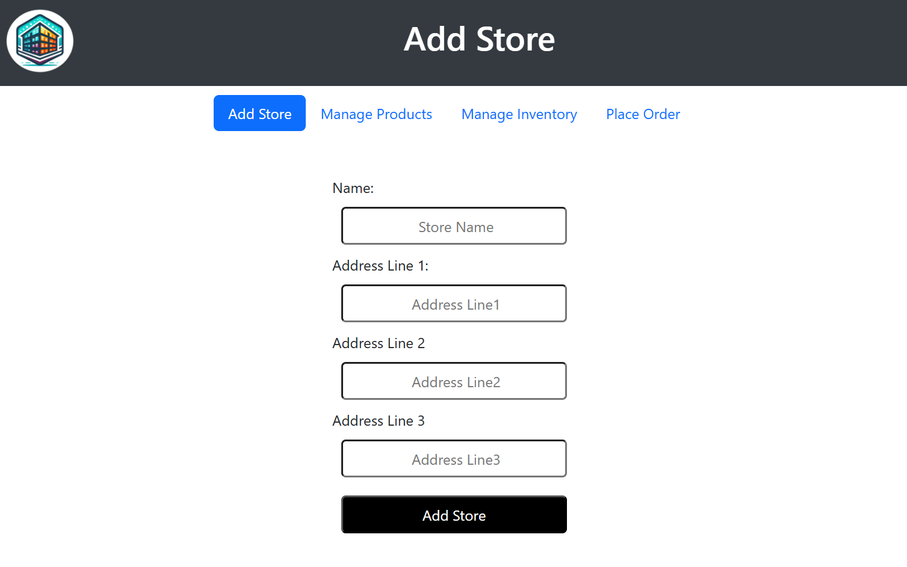
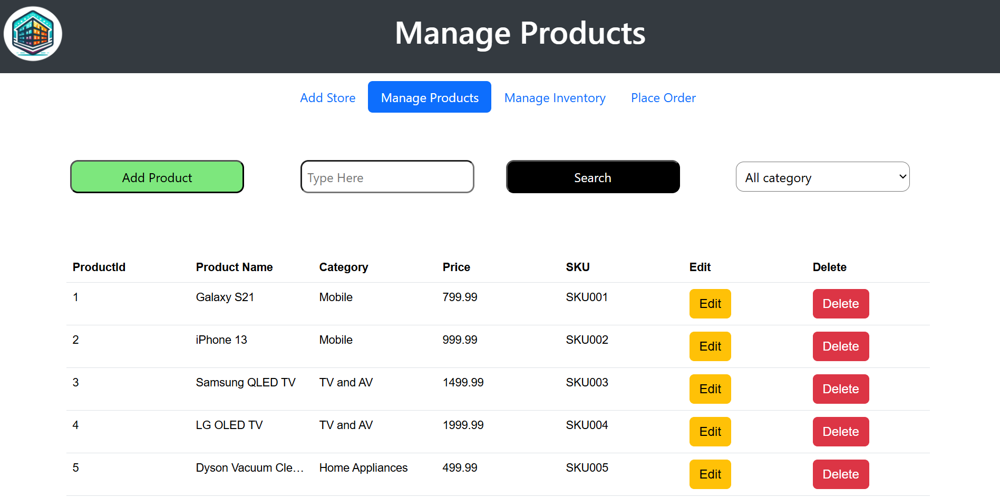
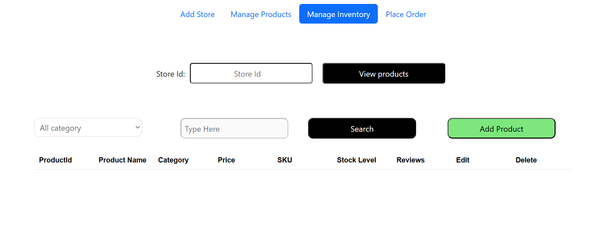
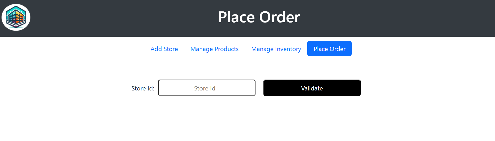
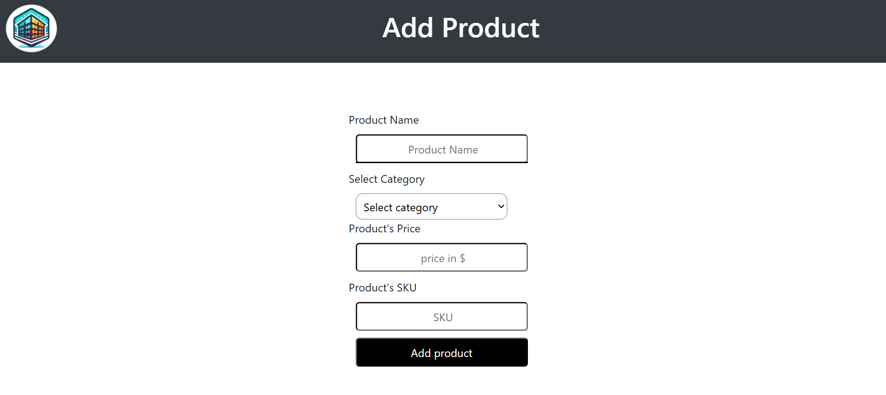

# Java Store Management System

A full-stack **Store Management System** built with **Spring Boot**, **MySQL**, and **MongoDB**.

This project demonstrates how to build a backend service using **Spring Boot** while integrating **relational databases (MySQL)** and **NoSQL databases (MongoDB)**. The application allows users to manage stores, products, inventory, and place orders through a simple web interface.

The system follows a **layered architecture** using:

- Spring Boot REST APIs
- Spring Data JPA
- Spring Data MongoDB
- Service / Repository architecture
- Transactional order processing

---

# Features

## Store Management
- Create and register new stores
- Validate store existence before placing orders

## Product Management
- Add products
- Edit products
- Delete products
- Search and filter products

## Inventory Management
- View store inventory
- Track stock levels
- Update inventory quantities

## Order Processing
- Place orders
- Automatically update inventory levels
- Prevent orders if stock is insufficient
- Transaction-safe order processing

## Review System
- Product reviews stored in **MongoDB**
- Retrieve reviews based on **store and product**

---

# Technologies Used

## Backend
- Java
- Spring Boot
- Spring Data JPA
- Spring Data MongoDB
- Maven

## Databases
- MySQL
- MongoDB

## Frontend
- HTML
- CSS
- JavaScript

---

# System Architecture

The project follows a **layered architecture**:

Controller Layer
Handles incoming HTTP requests

Service Layer
Contains business logic

Repository Layer
Handles database operations

Model Layer
Defines entities and DTO objects

Example project structure:

src/main/java/com/project/code

Controller
├── StoreController
├── ProductController
├── InventoryController
├── ReviewController
├── GlobalExceptionHandler

Service
├── OrderService
├── ServiceClass

Repo
 ├── ProductRepository
 ├── InventoryRepository
 ├── ReviewRepository
 ├── CustomerRepository
 ├── OrderDetailsRepository
 ├── OrderItemRepository
 ├── StoreRepository

Model

Entities
├── Store
├── Product
├── Inventory
├── Customer
├── OrderDetails
├── OrderItem
├── Review

DTOs
├── PlaceOrderRequestDTO
├── PurchaseProductDTO
├── CombinedRequestDTO

config
├── WebConfig

---

# Application Screens

## Add Store

Create a new store by entering store name and address information.

---

## Manage Products

View all products and perform **add, edit, delete, and search operations**.

---

## Manage Inventory

View and manage inventory for a selected store.

---

## Place Order

Place orders after validating the store ID.

---

## Add Product

Add a new product with **name, category, price, and SKU**.

---

# Running the Project

## 1 Clone the repository

git clone https://github.com/KutayStudy/java-database-final

cd java-database-final

---

## 2 Run the Backend

cd back-end
mvn spring-boot:run

The backend server will start at

http://localhost:8080

---

## 3 Run the Frontend

Open a new terminal and run:

cd front-end
python3 -m http.server 8000

The frontend will run at

http://localhost:8000

---

## 4 Open the Application

After starting both backend and frontend, open the application in your browser:

http://localhost:8000

---

# Database Setup

This project uses **two databases**.

## MySQL

Used for relational data:

- Stores
- Products
- Inventory
- Orders
- OrderItems
- Customers

## MongoDB

Used for:

- Product Reviews

Make sure **both databases are running before starting the application**.

---

# API Endpoints

## Store APIs

Create Store

POST /store

Validate Store

GET /store/validate/{storeId}

---

## Product APIs

Add Product

POST /product

Get All Products

GET /product

Update Product

PUT /product/{productId}

Delete Product

DELETE /product/{productId}

---

## Inventory APIs

View Inventory

GET /inventory/{storeId}

Update Inventory

PUT /inventory

---

## Order APIs

Place Order

POST /store/placeOrder

This endpoint:

- validates store
- checks product availability
- updates inventory
- creates order details
- creates order items

All operations run inside a **transaction**.

---

## Review APIs (MongoDB)

Get Reviews

GET /reviews/{storeId}/{productId}

Returns reviews for a specific **product in a specific store**.

---

# Author

Kutay  

Computer Engineering Student  
